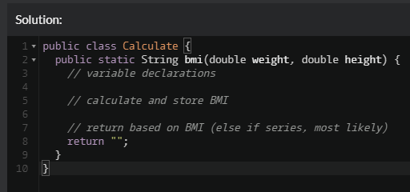
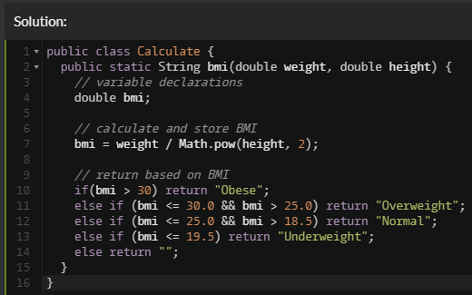

# Process Portfolio | Ryan Paranich | DGL104 2021

Process portfolio for DGL104, 2021, App Dev Foundations.

## Part 1

### Activity 0101

In CPS100 the one concept that really threw me for a loop at first was recursion. It took thinking about and looking at examples before it fully clicked. It's a visualization problem, ultimately. If you can't visualize what the code is doing it becomes really hard to look at and understand, and recursive thinking doesn't always come naturally when I look at problems and solutions.

I also really love the ternary operator for adding clarity in my code. It almost seems like a more simplified way of doing if statements that should have been taught at the begining of CPS100, not the end. I've used it alot in some of my final projects/assignments and on my exams. While we didn't really get a decent opportunity to look at others code and conduct a functional code review, I've often shared in study sessions how the operator can reshape someone's code for improed simplicity and readability.

For the sake of GitHub Markdown practice, here are a few examples of code I shared in one of my last study sessions of the term:

```
char id = boolVal ? 'A' : 'B';
```

```
System.out.println(
    "The value is " +
    val > 10 ? "greater " : "not greater " +
    "than 10."
    );
```

### Activity 1012

You know, I might be a bit bias, but I write some pretty neat and organized code. I wish we did more code reviews with our peers so that we could really get an understanding of where we might be able to really improve the readability for others.

I write detailed and descriptive comments. I organize my imports, properties, and methods. In general, I like the way this old project is structured.

Something I only started doing on my final exam was using the @ prefixes to help with intellisense when calling a method in external class code. As an example, by using @param I can define a quick tip that pertains to that specific parameter. I expect I'll be doing more of this in term 2 to improve the readability and enhancement of my code. I love organization!

---

### 0201

> Consider the apps that you use regularly. Choose one app to asses based on the reading Usability Matters Ch. 2. Identify the values inherent to the app that might help to identify the target user base (a list is fine, but be descriptive). Briefly describe the target user base. Do your goals in using the app match those of the target user base?

### 0202

> Consider a recent programming project (it can be one of those you identified last week). Examine the identifiers (i.e. variable and method names, etc.) used in the code. Are they sufficiently descriptive? Are they perhaps too descriptive (i.e. too long, or to complicated). Do they make sense in the context of your project? Identify between five and ten names in the code that you could consider changing either to be more descriptive, or more consistent with one another. Briefly explain your rationale.

I most definitely over commented some of my most recent projects. One of the problems I encountered was that there was no official style guide provided on what _good_ code looks like. I like having good structure provided, although I feel like I can also create a good structure of my own, but we never really had a clear and obvious rubric to hold our code up to and compare side-by-each.

When it came to naming in term 1, I wasn't too concerned about the grander scope for my variable/class/method naming conventions. I like the idea of an official class style guide to help us write better code to a defined template of rules. In projects I expect to expand, I can see how important it would have been to start with good naming convention and a set scheme or guide.

| oldNaming            | newNaming                     | rational                                                                                                                                                                                                                              |
| -------------------- | ----------------------------- | ------------------------------------------------------------------------------------------------------------------------------------------------------------------------------------------------------------------------------------- |
| `BadLengthException` | same                          | I'd keep this class name the same because it's perfectly descriptive while also being as short as I could equivilantly express it.                                                                                                    |
| `input`              | `userInput`                   | While in this instance the user is creating the input, it's useful to know that _this_ input is coming from the user. An input can come from anywhere.                                                                                |
| `fetch`              | same                          | I typically like using "fetch" as the name for my Scanner object. It identifies that I'm fetching something and storing it into a variable (in this case userInput).                                                                  |
| `done`               | `exitProgramLoop`             | In this project I had a "done" boolean which told a while loop whether or not I should keep looping. To be more descriptive, this boolean declares whether or not we should exit the main program loop. I could have been more clear. |
| `CheckLength()`      | `ValidateInputStringLength()` | My CheckLength() method didn't really describe what I was doing. I was, in fact, validating the length of a given input string and throwing an exception if the length was out of scope.                                              |
| `ValidateCode()`     | `FormatAndValidateInput()`    | The original method name could mean so many different things. This method takes an input, formats it, and then validates the input. Exceptions are thrown for different occurances of invalidation.                                   |

### 0203

> Visit CodeWars.com and create a new account (if you don't already have one). Consider using a non-identifiable email address for privacy purposes. Choose Java as your default language and choose to either 'Train' on Java, or go to the Kata menu and choose an 8 kyu exercise from the list of exercises. Give your kata of choice a try (don't spend overlong on it, if you get stuck). Take a screenshot of your code when you are done (whether you've finished the kata or not) and post it to your Process Portfolio. Briefly describe whether or not you found the kata challenging, and what stopped you if you got stuck.

**Problem Attempted:** https://www.codewars.com/kata/57a429e253ba3381850000fb/train/java

#### Started With Psudo Code



#### Code Written



#### Results


Well, I mean, I feel like that was too easy. That said, I could have done better. I could have certainly used the ternary operator here but I thought an `if else` gave more clarity. Was 8kyu supposed to be the hardest or easiest setting? I'm rather confused by that, as I thought the higher number would be harder.

---

### 0301

Google Maps is arguably the most popular maps app on iOS, Android, and even fringe platforms like Windows Phones. The app also functions as a PWA and works well on mobile devices. For the purpose of this exersise we will be looking at the Android and Google Chrome PWA versions of this app.

| Android | PWA
| --- | --- |
|  |  |
| In our native Android app the UI is considerably bigger. It uses app conventions with bars for tasks and functions. | In the PWA we notice right off the bat that the default zoom starts much further out. This is likely because the screen real estate is devoted more to peripheral buttons and features, where the map itself starts much smaller than in the native app. |
|  |  |
| In our native app the search button functions very differently. The way that history is shown and the way that we interact with the app is noticibly distinct in each version. | The PWA has your standard sandwich menu navigation fly-out, where as the native app is very different in that respect. There are also a number of features in the PWA that don't seem to be included, or at least not as readily available, in the native app. |

---

### 0302

On the [Android Development Guides](https://developer.android.com/guide) we find the [Design & Quality](https://developer.android.com/design) tab which takes us to an article describing why it's a good idea to style your app with platform consistency in mind. The idea being that users expect a certain look and feel to their apps to make navigation intuitive and easy use.

With regard to the structure of this documentation we see that there are breadcrumbs at the top of the screen, as well as a quick-link anchor navigation aside to the left of the main content.

Within the paragraph of text we see links to other documents with more in-depth information on sub-topics of this larger general topic, creating a sort of information hierarchy.

---