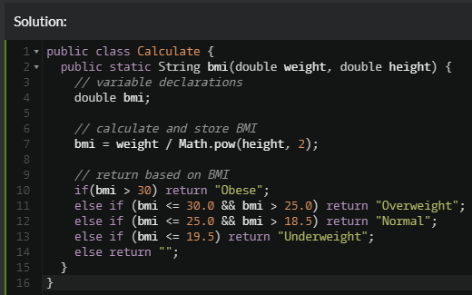
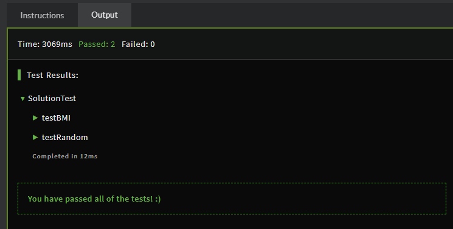

# DGL104 Process Portfolio | Week 2

Ryan Paranich | DGL104 | Winter 2021 | North Island College

---

## 0202

> Consider a recent programming project (it can be one of those you identified last week). Examine the identifiers (i.e. variable and method names, etc.) used in the code. Are they sufficiently descriptive? Are they perhaps too descriptive (i.e. too long, or to complicated). Do they make sense in the context of your project? Identify between five and ten names in the code that you could consider changing either to be more descriptive, or more consistent with one another. Briefly explain your rationale.

I most definitely over commented some of my most recent projects. One of the problems I encountered was that there was no official style guide provided on what _good_ code looks like. I like having good structure provided, although I feel like I can also create a good structure of my own, but we never really had a clear and obvious rubric to hold our code up to and compare side-by-each.

When it came to naming in term 1, I wasn't too concerned about the grander scope for my variable/class/method naming conventions. I like the idea of an official class style guide to help us write better code to a defined template of rules. In projects I expect to expand, I can see how important it would have been to start with good naming convention and a set scheme or guide.

| oldNaming            | newNaming                     | rational                                                                                                                                                                                                                              |
| -------------------- | ----------------------------- | ------------------------------------------------------------------------------------------------------------------------------------------------------------------------------------------------------------------------------------- |
| `BadLengthException` | same                          | I'd keep this class name the same because it's perfectly descriptive while also being as short as I could equivilantly express it.                                                                                                    |
| `input`              | `userInput`                   | While in this instance the user is creating the input, it's useful to know that _this_ input is coming from the user. An input can come from anywhere.                                                                                |
| `fetch`              | same                          | I typically like using "fetch" as the name for my Scanner object. It identifies that I'm fetching something and storing it into a variable (in this case userInput).                                                                  |
| `done`               | `exitProgramLoop`             | In this project I had a "done" boolean which told a while loop whether or not I should keep looping. To be more descriptive, this boolean declares whether or not we should exit the main program loop. I could have been more clear. |
| `CheckLength()`      | `ValidateInputStringLength()` | My CheckLength() method didn't really describe what I was doing. I was, in fact, validating the length of a given input string and throwing an exception if the length was out of scope.                                              |
| `ValidateCode()`     | `FormatAndValidateInput()`    | The original method name could mean so many different things. This method takes an input, formats it, and then validates the input. Exceptions are thrown for different occurances of invalidation.                                   |

---

## 0203

> Visit CodeWars.com and create a new account (if you don't already have one). Consider using a non-identifiable email address for privacy purposes. Choose Java as your default language and choose to either 'Train' on Java, or go to the Kata menu and choose an 8 kyu exercise from the list of exercises. Give your kata of choice a try (don't spend overlong on it, if you get stuck). Take a screenshot of your code when you are done (whether you've finished the kata or not) and post it to your Process Portfolio. Briefly describe whether or not you found the kata challenging, and what stopped you if you got stuck.

**Problem Attempted:** https://www.codewars.com/kata/57a429e253ba3381850000fb/train/java

#### Started With Psudo Code

#### Code Written

#### Results

While it felt easy, I could have done better. I could have certainly used the ternary operator here but I thought an `if else` gave more clarity. Was 8kyu supposed to be the hardest or easiest setting? I'm rather confused by that, as I thought the higher number would be harder.
