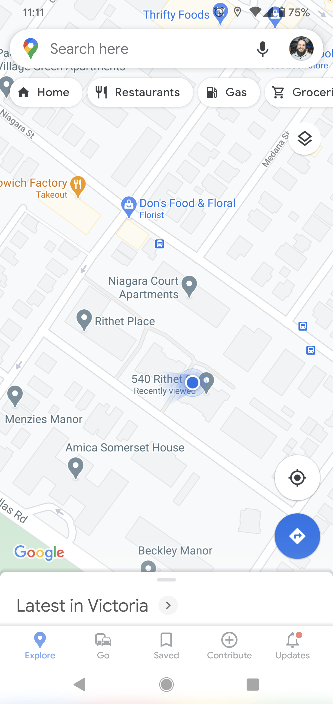
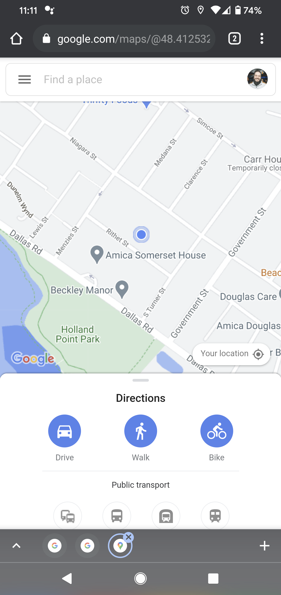

# DGL104 Process Portfolio | Week 3

Ryan Paranich | DGL104 | Winter 2021 | North Island College

## 0301

Google Maps is arguably the most popular maps app on iOS, Android, and even fringe platforms like Windows Phones. The app also functions as a PWA and works well on mobile devices. For the purpose of this exersise we will be looking at the Android and Google Chrome PWA versions of this app.

| Android                                                                                                                                                                        | PWA                                                                                                                                                                                                                                                            |
| ------------------------------------------------------------------------------------------------------------------------------------------------------------------------------ | -------------------------------------------------------------------------------------------------------------------------------------------------------------------------------------------------------------------------------------------------------------- |
|                                                                                                                              |                                                                                                                                                                                                              |
| In our native Android app the UI is considerably bigger. It uses app conventions with bars for tasks and functions.                                                            | In the PWA we notice right off the bat that the default zoom starts much further out. This is likely because the screen real estate is devoted more to peripheral buttons and features, where the map itself starts much smaller than in the native app.       |
|                                                                                                                              |                                                                                                                                                                                                              |
| In our native app the search button functions very differently. The way that history is shown and the way that we interact with the app is noticibly distinct in each version. | The PWA has your standard sandwich menu navigation fly-out, where as the native app is very different in that respect. There are also a number of features in the PWA that don't seem to be included, or at least not as readily available, in the native app. |

---

## 0302

On the [Android Development Guides](https://developer.android.com/guide) we find the [Design & Quality](https://developer.android.com/design) tab which takes us to an article describing why it's a good idea to style your app with platform consistency in mind. The idea being that users expect a certain look and feel to their apps to make navigation intuitive and easy use.

With regard to the structure of this documentation we see that there are breadcrumbs at the top of the screen, as well as a quick-link anchor navigation aside to the left of the main content.

Within the paragraph of text we see links to other documents with more in-depth information on sub-topics of this larger general topic, creating a sort of information hierarchy.

---
