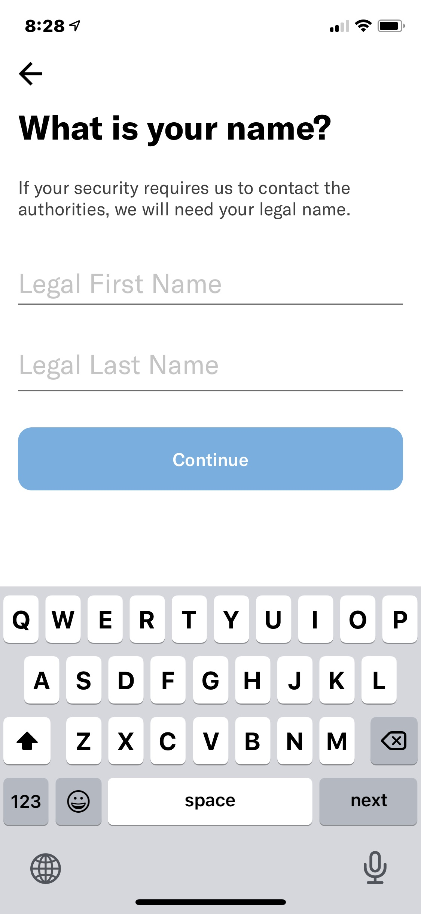
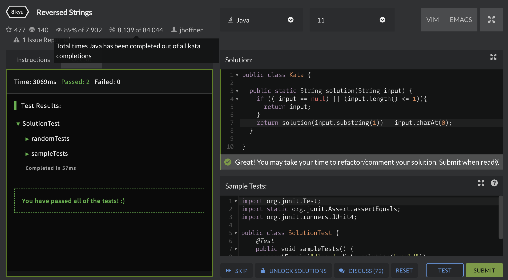

# DGL104 Process Portfolio | Week 4

Ryan Paranich | DGL104 | Winter 2021 | North Island College

---

## 0401

> Scroll through either pttrns.com or mobile-patterns.com (watch out for ads) and pick a pattern that is of interest to you (it can be one you’ve used before, or not). Consider the when and how the pattern should be used and write a short summary (a paragraph) that outlines why you think the pattern is valuable (similar to - but shorter than - the introductory summaries for each of the patterns presented in UX Design Patterns for Mobile Apps: Which and Why.

This pattern could be used for filling out important user information pretaining to your app. This information is being used in a situation where your legal first and last name would be required, so the activity asks for both dlearly, distinctly, and individually. The "continue" button is greyed out - presumably until the user has submitted validated information into both fields. This indicates to the user that this information is important and that you must enter this information before they may continue. It is somewhat unclear, but the presance of the keyboard on this screen suggests that the first field is automatically set up to start filling, to save the user having to tap the first field to start typing. The enter/return button has been replaced with a "next" button, to allow the user to step through the fields (again, presumably) as they enter the information.

I think the pattern is valuable because it clearly outlines what is expected, both in explicit instruction and also in workflow.

---

## 0402

> After reading Pragmatic Programmer - Orthogonality try Exercise 1 at the bottom of the reading. Write down your justification for your answer on your Process Portfolio. Then briefly explain how the concept of orthogonality relates to MVC.

---

## 0403

> Visit CodeWars.com and attempt at least two katas. Ideally you should finish both - so choose something that is within your level of programming expertise.

I chose a simple reverse word Kata. I'm not too familiar with CodeWars yet, but I used recursion to reverse the string and output the soution, and it seemed to work.